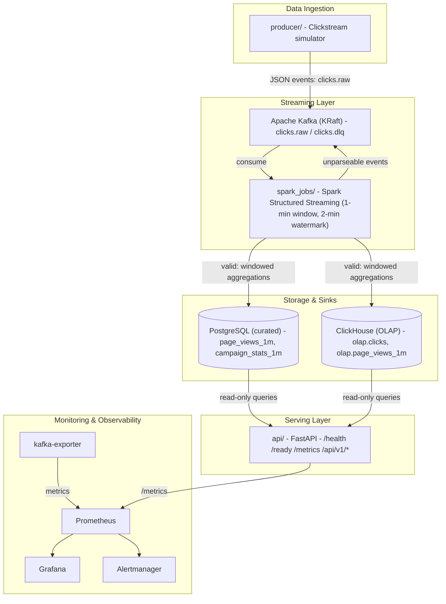
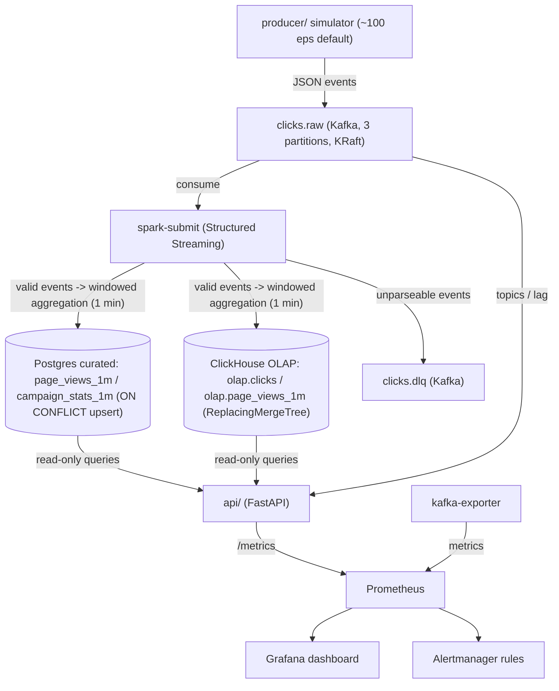

# Clickstream — Phased Project Plan

Status: v0.1 (planning) · Last updated: 2026-08-27

This document is the living execution plan for the clickstream portfolio project.
It complements `DESIGN.md` (architecture / tech-stack coverage) and the docs in
`docs/` (add-on research and guardrails). Work is executed phase by phase; each
phase ends with working code, passing tests, updated docs, and a summary of what
was built, what was deferred, and the decisions made.

**Linear tracking:** each phase maps to one Linear milestone (M1–M5) and every
to-do item in the phase checklists below maps to one Linear ticket. Ticket
creation happens only after user approval.

---

## 0. Guiding Principles

- **Portfolio, not production**: a small, personal, from-scratch project. Every
  claim about scale or capability must be backed by real measurements from our
  own runs. Never imply employer (employer) production experience.
- **Public-repo safe**: no proprietary code, configs, internal names, or metrics.
  All code is original and generic.
- **Pin everything**: every dependency, image, and tool version is locked; every
  technology actually runs locally and is explainable in interviews.
- **Tests are non-negotiable**: `make lint` and `make test` must pass before a
  phase is considered done.
- **No half-added features**: anything out of scope for the current phase goes to
  the "NEXT SESSION" section instead of being partially implemented.
- **Ask before diverging**: changes to the DESIGN.md architecture or additions of
  new technologies not already listed in the docs require user confirmation.

---

## 1. Tech Stack Selection

What each technology is for and why we picked it (aligned with the saved job
descriptions in `docs/` and `docs/sample_jd`).

| Technology | What it is for | Why we chose it |
|---|---|---|
| Python 3.11 | Main implementation language: producer, API, tests, tooling | Standard in data engineering; fast to iterate; every target JD lists Python |
| Apache Kafka (KRaft) | Streaming backbone: ingest `clicks.raw`, DLQ topic, consumer groups, offsets, lag | De-facto standard for event streaming; explicitly required by JDs; KRaft removes ZooKeeper so the local demo stays simple |
| confluent-kafka (librdkafka) | Python Kafka producer: batching, retries, idempotence, compression | Production-grade client; `enable.idempotence`, `acks=all`, `linger.ms`/`batch.size` directly implement our reliability requirements |
| Spark Structured Streaming (PySpark) | Stream processing: 1-min windowed aggregations → Postgres + ClickHouse; DLQ routing | JDs require Spark; Structured Streaming provides watermarking and exactly-once-ish semantics with a SQL-like API |
| PostgreSQL 16 | Curated relational store: `page_views_1m`, `campaign_stats_1m` | ACID + `ON CONFLICT` upserts make sink writes idempotent; standard RDBMS for SQL analytics and API queries |
| ClickHouse 24.8 | OLAP columnar sink: raw events + window aggregates for fast analytics | Columnar engine makes GROUP BY over large event volumes fast; JDs explicitly mention ClickHouse/Druid |
| Redis 7 | In-memory cache / rate limiting / session state for the API (infra in Phase 1, used in Phase 2) | JDs require Redis; simple, fast, and standard for caching |
| FastAPI | Read-only REST/JSON API: health, readiness, query endpoints, metrics | Modern async framework with automatic OpenAPI docs; JDs require REST/JSON |
| kafka-python | Kafka admin client in the API (topics, offsets, consumer lag) | Lightweight pure-Python, read-only admin access without a JVM |
| psycopg 3 | PostgreSQL driver + connection pool for the API | Mature, actively maintained driver with built-in pooling |
| clickhouse-connect | ClickHouse HTTP client for API queries | Official lightweight client over the HTTP interface |
| prometheus-client | API instrumentation: latency histogram, counters, lag gauges | Standard Prometheus instrumentation, no framework lock-in |
| Docker + Compose | Package and orchestrate every service locally | Reproducible laptop demo; the same images later move to kind/EKS |
| Prometheus | Metrics collection and alert evaluation | De-facto standard monitoring stack; scrapes kafka-exporter and the API |
| Grafana | Dashboards: Kafka lag, DLQ, throughput, API latency | Standard visualization layer; auto-provisioned from this repo |
| Alertmanager | Alert routing, deduplication, and notifications | Pairs with Prometheus for SRE-style alerting (rules in `monitoring/`) |
| kafka-exporter | Exposes broker/consumer-group metrics (lag) to Prometheus | Standard way to get Kafka consumer lag into Prometheus/Grafana |
| pytest | Unit + integration tests | Standard Python test framework; markers/fixtures support auto-skipping integration tests |
| ruff | Linting | Fast, modern linter; used by `make lint` |
| GitHub Actions | CI: lint → unit → integration → build & push images | Free and GitHub-native; JDs require CI/CD |

## 2. Architecture Overview



Note: PostgreSQL and ClickHouse are **parallel sinks** written by Spark; the API
reads from both (Postgres for curated aggregates, ClickHouse for raw/OLAP queries).
The DLQ path runs as a second streaming query and therefore reads the topic twice —
an accepted demo trade-off (documented in DESIGN.md).

## 3. Phase 1 — Local Core Pipeline (current session)

Goal: `make up` starts the full stack locally; a producer emits click events;
Spark aggregates them into curated tables; the API serves read-only queries;
Grafana shows Kafka lag and API latency; `make test` is green; README + DESIGN.md
record real measured metrics.

### 3.1 Deliverables

| # | Deliverable | Details |
|---|---|---|
| 1 | `producer/` | Python clickstream simulator producing JSON events to `clicks.raw`: batching, retries, idempotent producer, config via env, CLI (`--rate --duration --max-events --seed`), periodic throughput logging |
| 2 | `spark_jobs/` | Spark Structured Streaming consuming `clicks.raw`: 1-minute tumbling window + 2-minute watermark → Postgres (curated, idempotent upsert) and ClickHouse (OLAP, ReplacingMergeTree); parse failures → `clicks.dlq` |
| 3 | `api/` | FastAPI: `/health`, `/ready`, `/metrics`; read-only REST/JSON queries (summary, top pages/campaigns from Postgres; recent events/timeline from ClickHouse; Kafka topics + lag); Prometheus request-latency histogram + lag gauges |
| 4 | `docker-compose.yml` | Kafka (KRaft), kafka-init, kafka-exporter, Spark (master/worker/submit), Postgres, ClickHouse, Redis, API, producer, Prometheus, Alertmanager, Grafana — all pinned, with healthchecks and `depends_on: service_healthy` chains; replaces existing TODO stubs |
| 5 | `tests/` | pytest: unit (producer serialization, simulator, config, API with mocked DB) + integration (local Kafka/Postgres, auto-skip when services are unavailable) |
| 6 | `monitoring/` | Prometheus scrape configs (kafka-exporter, API), alert rules (lag, DLQ, API p95), Alertmanager config, Grafana dashboard (Kafka lag, DLQ, throughput, API latency) provisioned automatically |
| 7 | Docs | README + DESIGN.md updated: architecture as-built, sample data, quick start, real measured metrics |

### 3.2 Target versions (verify at install/build time, then pin)

| Component | Version |
|---|---|
| Python | 3.11 |
| Kafka (KRaft) | `apache/kafka:3.7.0` |
| Spark | `apache/spark:3.5.7` |
| PostgreSQL | `postgres:16.4` |
| ClickHouse | `clickhouse/clickhouse-server:24.8` |
| Redis | `redis:7.4-alpine` |
| Prometheus | `prom/prometheus:v2.53.1` |
| Alertmanager | `prom/alertmanager:v0.27.0` |
| Grafana | `grafana/grafana:11.2.0` |
| kafka-exporter | `danielqsj/kafka-exporter:v1.7.0` |
| Kafka client | `confluent-kafka` (librdkafka) |
| API stack | FastAPI, uvicorn, psycopg, clickhouse-connect, kafka-python, prometheus-client, pydantic-settings |
| Dev/CI | pytest, ruff, httpx |

### 3.3 Data flow



Note: the DLQ path runs as a second streaming query over the same topic, so it
reads the stream twice; this is an accepted demo trade-off and documented in
DESIGN.md.

### 3.4 Sample data

See Section 8. The producer generates deterministic, synthetic clickstream data
(no real user data, no employer data). A small static fixture
(`sample_data/clicks.sample.json`, ~200 events from a fixed seed) is committed for
tests and quick demos; the live pipeline uses the simulator.

### 3.5 Monitoring & alerting

- Prometheus scrapes: `kafka-exporter:9308`, `api:8000/metrics`.
- Alert rules (examples): consumer lag > 5,000 for 5 min; DLQ topic has messages;
  API p95 latency > 1 s.
- Grafana dashboard (auto-provisioned): Kafka consumer lag, produce/consume
  throughput, DLQ depth, API request rate and latency (p50/p95).

### 3.6 Acceptance criteria

- [ ] `make up` → all services healthy (no restart loops)
- [ ] Producer emits events; Spark aggregates; data visible in Postgres + ClickHouse
- [ ] API serves queries; `/metrics` exposes Prometheus data
- [ ] Grafana dashboard shows Kafka lag / API latency panels with data
- [ ] `make lint` and `make test` pass (integration tests auto-skip if no Docker)
- [ ] README + DESIGN.md updated with real measured metrics (throughput, freshness,
      API latency, Kafka lag)

### 3.7 To-dos (tracked in Linear: Milestone M1, one ticket per item)

- [ ] **P1-01** Scaffold repo layout and root tooling (Makefile, .gitignore, pyproject.toml, requirements-dev.txt, .env.example)
- [ ] **P1-02** Producer: event schema + deterministic simulator (weighted pages/devices/regions/campaigns/users/sessions, seed)
- [ ] **P1-03** Producer: Kafka client (batching, retries, idempotence, compression, throughput logging, CLI)
- [ ] **P1-04** Spark job: Kafka consume + JSON parse + watermark/window aggregation
- [ ] **P1-05** Spark job: PostgreSQL sink (curated tables, ON CONFLICT upsert)
- [ ] **P1-06** Spark job: ClickHouse sink (ReplacingMergeTree, raw events + window aggregates)
- [ ] **P1-07** Spark job: DLQ routing for unparseable events
- [ ] **P1-08** API: FastAPI health/ready endpoints + read-only query endpoints
- [ ] **P1-09** API: Prometheus metrics (latency histogram, counters, Kafka lag gauges)
- [ ] **P1-10** Init scripts: Postgres schema, ClickHouse schema, Kafka topics
- [ ] **P1-11** docker-compose.yml: all services pinned + healthchecks + depends_on chains
- [ ] **P1-12** Monitoring: Prometheus scrape configs, Alertmanager rules, Grafana dashboard provisioning
- [ ] **P1-13** Tests: unit (serialization, simulator, config, API)
- [ ] **P1-14** Tests: integration (Kafka, Postgres, full pipeline; auto-skip when infra down)
- [ ] **P1-15** `make lint` + `make test` green
- [ ] **P1-16** Full-stack bring-up + end-to-end verification (producer → Spark → PG/CH → API → Grafana)
- [ ] **P1-17** Measure real metrics (throughput, freshness, API latency, lag) + update README/DESIGN.md/CI

---

## 4. Phase 2 — Data-Engineering Depth (v1 add-ons)

Each addition must actually run locally and be documented in README + DESIGN.md.

| Tech | Where it fits | Notes |
|---|---|---|
| Airflow | `etl/dags/` | Batch orchestration: schedule validation/ETL jobs, freshness checks |
| dbt | `dbt/` | SQL models + tests on top of curated Postgres tables |
| Delta Lake / Iceberg | `spark_jobs/` | Lakehouse writes (local or S3) from Spark; document merge semantics |
| Data quality | `quality/` | Great Expectations or Soda validation suites + rendered reports |
| Redis caching / rate limiting | `api/` | Cache hot query results; rate-limit read endpoints |
| `go_ops/` | Go CLI / control-plane | Health checks, topic status, lag reporting |
| `ansible/` | Playbooks | Provision demo nodes / EKS bastion |
| `ai_assistant/` | Python/FastAPI + LLM | Explain alerts, generate read-only SQL; simple anomaly detection on lag/latency |

### 4.1 To-dos (tracked in Linear: Milestone M2, one ticket per item)

- [ ] **P2-01** Airflow DAGs: batch orchestration / ETL scheduling
- [ ] **P2-02** dbt: SQL models + tests on curated Postgres tables
- [ ] **P2-03** Lakehouse: Delta Lake / Iceberg writes from Spark (local or S3)
- [ ] **P2-04** Data quality: Great Expectations or Soda suites + reports
- [ ] **P2-05** API: Redis caching + rate limiting
- [ ] **P2-06** go_ops: Go CLI / control-plane (health, topic status, lag)
- [ ] **P2-07** Ansible: provisioning playbooks (demo nodes / EKS bastion)
- [ ] **P2-08** ai_assistant: LLM pipeline-ops assistant + anomaly detection on lag/latency
- [ ] **P2-09** Verify each add-on locally; update README + DESIGN.md; lint + test green

## 5. Phase 3 — Deployment & Platform (kind → EKS)

| Item | Details |
|---|---|
| kind | Local Kubernetes cluster + manifests for all components |
| Terraform EKS | VPC, node group, ALB; `make eks-apply` / `make eks-destroy` (cost control) |
| Helm | Package k8s manifests as charts |
| cert-manager | TLS certificate lifecycle |
| CI/CD | GitHub Actions: lint → unit → integration → build & push images → optional deploy |
| Optional | AWS Lambda + API Gateway (DLQ alert handler / freshness checker), CloudWatch integration |

### 5.1 To-dos (tracked in Linear: Milestone M3, one ticket per item)

- [ ] **P3-01** kind: local Kubernetes cluster + manifests
- [ ] **P3-02** Terraform EKS: VPC, node group, ALB
- [ ] **P3-03** Helm charts + cert-manager
- [ ] **P3-04** CI/CD: GitHub Actions (lint, unit, integration, build & push, optional deploy)
- [ ] **P3-05** Optional: AWS Lambda + API Gateway (DLQ alert handler / freshness checker) + CloudWatch
- [ ] **P3-06** Teardown automation + cost control (`make eks-destroy`)
- [ ] **P3-07** Deploy to EKS, verify, teardown; document results

## 6. Phase 4 — Reliability & Scale (stretch)

| Item | Details |
|---|---|
| SLO/SLI | Availability, p95 latency, data freshness, DLQ rate; error-budget policy |
| Alerting + runbooks | Alertmanager rules + runbook template + on-call docs |
| Post-incident review | Blameless PIR template; one deliberate drill |
| Load testing | k6 / Locust; capacity estimates |
| Chaos / failure drills | Kill a broker/pod; record MTTR |
| Optional | Kong API gateway, Istio (mTLS/canary), Flink variant, GitOps (Argo CD/Rollouts), AWS MSK, OpenSearch |

### 6.1 To-dos (tracked in Linear: Milestone M4, one ticket per item)

- [ ] **P4-01** SLO/SLI + error budgets (docs)
- [ ] **P4-02** Alertmanager + runbooks + post-incident review template
- [ ] **P4-03** Load testing (k6 / Locust) + capacity estimates
- [ ] **P4-04** Chaos / failure drills (kill broker/pod; record MTTR)
- [ ] **P4-05** Optional: Kong API gateway
- [ ] **P4-06** Optional: Istio service mesh (mTLS, canary)
- [ ] **P4-07** Optional: Flink variant
- [ ] **P4-08** Optional: GitOps (Argo CD / Argo Rollouts)
- [ ] **P4-09** Optional: AWS MSK / OpenSearch
- [ ] **P4-10** Document results (SLO compliance, capacity, MTTR)

## 7. Phase 5 — Portfolio Packaging

Goal: make the repo share-ready and interview-ready — final metrics, architecture
diagram, public-repo hygiene, and a demo script.

### 7.1 To-dos (tracked in Linear: Milestone M5, one ticket per item)

- [ ] **P5-01** Final measured metrics (throughput, latency, lag, cost) in README
- [ ] **P5-02** Architecture diagram + design decisions summary
- [ ] **P5-03** Public-repo hygiene: MIT LICENSE, no employer IP, README states personal/portfolio project
- [ ] **P5-04** Interview talking points + demo script (`make up` → data flow → dashboards)
- [ ] **P5-05** Final repo review + README polish

## 8. Sample Data — Synthetic Clickstream

### 8.1 Why synthetic

- Public-repo safe: no real user data, no employer (employer) data, no PII.
- Deterministic and reproducible: a fixed seed regenerates identical datasets for
  tests, demos, and documentation.
- Realistic enough to exercise the pipeline meaningfully (cardinality, skew,
  windows, aggregation, OLAP queries).

### 8.2 Event schema (JSON, one event per Kafka message)

```json
{
  "event_id": "9f8c2b3a-...",          // UUID v4
  "event_type": "page_view",           // page_view | click | add_to_cart | purchase
  "user_id": "u-1234",                 // synthetic user pool: u-0001..u-5000
  "session_id": "s-7d1e...",           // shared across events in one session
  "ts": "2026-08-27T15:00:00Z",        // ISO-8601 UTC event time
  "page": "/product/42",               // weighted page distribution (see below)
  "device": "mobile",                  // mobile | desktop | tablet
  "region": "us-west",                 // us-west, us-east, eu-west, ap-southeast, ...
  "campaign_id": "c-3",                // c-1..c-8, or "organic"
  "referrer": "google"                 // google | facebook | email | direct | ...
}
```

### 8.3 Realistic distribution (weighted, seeded)

| Dimension | Values | Weights / notes |
|---|---|---|
| Pages | `/home`, `/search`, `/product/<id>`, `/cart`, `/checkout`, `/account`, `/help` | product-heavy (30%), home 25%, search 15%, cart 10%, checkout 5%… |
| Device | mobile / desktop / tablet | mobile 55%, desktop 35%, tablet 10% |
| Regions | us-west, us-east, eu-west, ap-southeast, eu-central, sa-east | us-west 40% (skew) |
| Campaigns | c-1..c-8 + organic | organic 40%, rest split |
| Referrers | google, facebook, email, direct, ads | google/direct dominant |
| Users | u-0001..u-5000 | power-law-ish activity: small share of users generate most events |
| Sessions | multiple events share `session_id` | 3–20 events per session, correlated page paths (home → product → cart → checkout) |

### 8.4 Volumes & modes

- **Steady mode (default)**: ~100 events/sec continuous — safe on a laptop with
  Kafka + Spark + Postgres + ClickHouse in Docker.
- **Burst mode**: `--rate 1000` with `--max-events 10000` to measure peak
  throughput, consumer lag, and recovery time.
- **Fixture**: `sample_data/clicks.sample.json` (~200 events, fixed seed) for unit
  tests, offline demos, and documentation examples.

### 8.5 Data quality / edge cases built into the simulator (opt-in)

- A small rate of malformed events (e.g., missing `ts` or bad JSON) can be enabled
  with `--inject-errors 0.1%` to demonstrate the DLQ path end to end.

## 9. Measurement Methodology (real, from our own runs)

| Metric | How it is measured |
|---|---|
| Producer throughput | Producer log: delivered events / elapsed seconds (steady + burst) |
| End-to-end freshness | Time from event timestamp to its window row visible in Postgres (poll API/DB) |
| API latency p50/p95 | `scripts/bench_api.py` fires N read requests, computes percentiles (also visible in Prometheus histogram) |
| Kafka consumer lag | kafka-exporter / API `/api/v1/health/topics`; recovery time after burst |
| Spark processing | Driver logs: micro-batch processing time vs event time |

Results are recorded in README "Measured Metrics" and DESIGN.md with the run date,
environment, and configuration used. No numbers are claimed without a measured run.

## 10. Cross-Cutting Constraints

- No code/config from any employer; everything original and generic.
- Every dependency pinned; every technology runs and is explainable.
- Core logic has tests; `make lint` + `make test` green before finishing a phase.
- Confirm with the user before changing DESIGN.md architecture or adding new tech.

## 11. Open Decisions (to confirm)

1. Docker runtime: colima must be started for full-stack verification and real
   metrics (requires user approval or manual `colima start`).
2. Whether `make up` starts the producer by default (recommended: yes,
   `restart: unless-stopped`, disable via env) plus a `make demo` foreground mode.
3. Default steady rate: 100 events/sec (adjustable via env/CLI).
4. Linear: one ticket per to-do item, one milestone (M1–M5) per phase; ticket
   creation only after user approval of the batch.

## 12. NEXT SESSION (deferred, never half-added)

- Phase 2: Airflow, dbt, Delta/Iceberg, data quality, Redis caching/rate limit,
  `go_ops/`, `ansible/`, `ai_assistant/`.
- Phase 3: kind, Terraform EKS, Helm, cert-manager, GitHub Actions deploy, Lambda.
- Phase 4: SLO/SLI, runbooks, PIR, k6/Locust, chaos drills, Kong/Istio/Flink/GitOps.
- Phase 5: LICENSE (MIT), architecture diagram, interview talking points, demo script.
