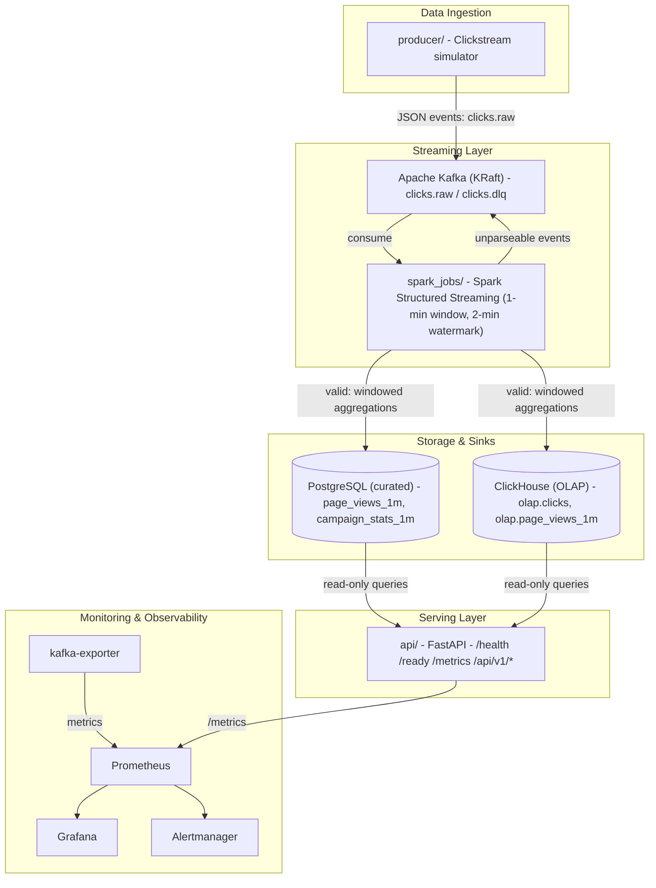
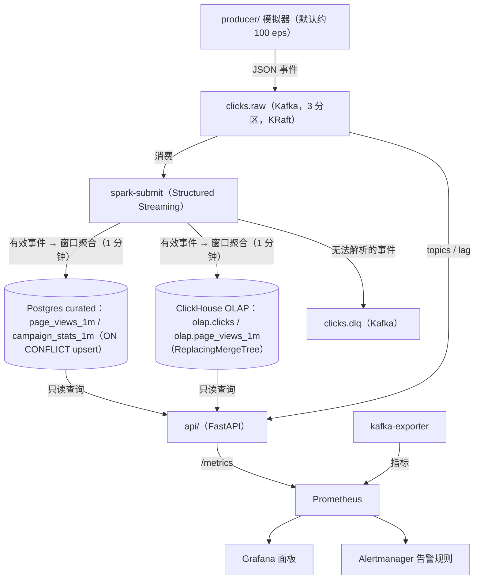

# Clickstream — 分阶段项目计划（中文版）

状态：v0.1（规划中）· 最后更新：2026-08-27

本文档是 clickstream 作品集项目的可执行计划（中文版）。它与 `DESIGN.md`（架构 / 技术栈覆盖）以及
`docs/` 下的文档（附加技术研究、协作与合规边界）互为补充。工作按阶段执行；每个阶段结束时应包含：
可运行的代码、通过的测试、更新的文档，以及一份「做了什么 / 推迟了什么 / 做了哪些决策」的总结。

**Linear 追踪**：每个 Phase 对应一个 Linear milestone（M1–M5），下面每个 to-do 条目对应一张 Linear
ticket。ticket 创建仅在用户批准后进行。

英文版见 [`PLAN.md`](PLAN.md)。

---

## 0. 指导原则

- **作品集项目，不是生产系统**：这是一个小型、个人、从零开始的项目。任何关于规模或能力的表述
  都必须以我们自己运行产生的真实测量数据为依据。绝不暗示这是雇主（Intuit）的生产经验。
- **公共仓库安全**：不包含任何专有代码、配置、内部名称或内部指标。所有代码均为原创、通用。
- **全部锁定版本**：每个依赖、镜像、工具版本都固定；每项技术都必须在本地真正运行，并且能在面试中讲清楚。
- **测试不可妥协**：阶段完成前 `make lint` 与 `make test` 必须通过。
- **不半途添加功能**：超出当前阶段范围的任何内容都放入「NEXT SESSION」小节，而不是做一半。
- **变更前先确认**：修改 DESIGN.md 架构、或新增文档中未列出的新技术，必须先征得用户确认。

---

## 1. 技术栈清单（用途与选型理由）

每项技术的用途、以及为什么选择它（与 `docs/` 和 `~/projects/Resume/sample_jd` 中保存的 JD 对齐）。

| 技术 | 用途 | 选型理由 |
|---|---|---|
| Python 3.11 | 主要实现语言：producer、API、测试、工具脚本 | 数据工程领域的标准语言，迭代快；每个目标 JD 都要求 Python |
| Apache Kafka (KRaft) | 流式主干：接收 `clicks.raw`、DLQ topic、消费组、offset、lag | 事件流的事实标准，JD 明确要求；KRaft 免去 ZooKeeper，本地演示更简单 |
| confluent-kafka (librdkafka) | Python Kafka 生产者：批量、重试、幂等、压缩 | 生产级客户端；`enable.idempotence`、`acks=all`、`linger.ms`/`batch.size` 直接落实可靠性要求 |
| Spark Structured Streaming (PySpark) | 流处理：1 分钟窗口聚合 → Postgres + ClickHouse；DLQ 路由 | JD 要求 Spark；Structured Streaming 提供 watermark 与近似 exactly-once 语义，且 API 接近 SQL |
| PostgreSQL 16 | curated 关系存储：`page_views_1m`、`campaign_stats_1m` | ACID + `ON CONFLICT` upsert 让写入幂等；是 SQL 分析与 API 查询的标准 RDBMS |
| ClickHouse 24.8 | OLAP 列式存储：原始事件 + 窗口聚合，支撑快速分析 | 列式引擎让大事件量上的 GROUP BY 很快；JD 明确提到 ClickHouse/Druid |
| Redis 7 | API 的内存缓存 / 限流 / 会话状态（Phase 1 先备好基础设施，Phase 2 启用） | JD 要求 Redis；简单、快，是缓存的标准选择 |
| FastAPI | 只读 REST/JSON API：健康检查、就绪检查、查询端点、指标 | 现代异步框架，自带 OpenAPI 文档；JD 要求 REST/JSON |
| kafka-python | API 中的 Kafka admin 客户端（topics、offset、consumer lag） | 轻量纯 Python，只读运维访问，无需 JVM |
| psycopg 3 | API 的 PostgreSQL 驱动 + 连接池 | 成熟、维护活跃，内置连接池 |
| clickhouse-connect | API 查询 ClickHouse 的 HTTP 客户端 | 官方轻量客户端，走 HTTP 接口 |
| prometheus-client | API 埋点：请求延迟直方图、计数器、lag gauge | 标准 Prometheus 埋点库，无框架绑定 |
| Docker + Compose | 本地打包与编排所有服务 | 笔记本电脑上可复现的演示；同一镜像后续可迁移到 kind/EKS |
| Prometheus | 指标采集与告警规则评估 | 监控栈事实标准；抓取 kafka-exporter 与 API |
| Grafana | 面板：Kafka lag、DLQ、吞吐、API 延迟 | 标准可视化层；从本仓库自动 provisioning |
| Alertmanager | 告警路由、去重与通知 | 与 Prometheus 配套，实现 SRE 式告警（规则在 `monitoring/`） |
| kafka-exporter | 向 Prometheus 暴露 broker/消费组指标（lag） | 把 Kafka consumer lag 接入 Prometheus/Grafana 的标准方式 |
| pytest | 单元 + 集成测试 | Python 标准测试框架；fixture/marker 支持集成测试自动跳过 |
| ruff | 代码检查（lint） | 快速、现代的 linter；`make lint` 使用 |
| GitHub Actions | CI：lint → unit → integration → 构建并推送镜像 | 免费且与 GitHub 原生集成；JD 要求 CI/CD |

## 2. 架构总览



说明：PostgreSQL 与 ClickHouse 是 Spark 写入的**并行 sink**；API 同时读两者
（Postgres 提供 curated 聚合，ClickHouse 提供原始事件/OLAP 查询）。DLQ 路径以第二条流式查询运行，
因此会二次读取 topic——这是演示场景接受的取舍（在 DESIGN.md 中说明）。

## 3. Phase 1 — 本地核心流水线（当前会话）

目标：`make up` 在本地启动全栈；生产者持续产生点击事件；Spark 聚合成 curated 表；API 提供只读查询；
Grafana 展示 Kafka lag 与 API 延迟；`make test` 全绿；README + DESIGN.md 记录真实测量指标。

### 3.1 交付物

| # | 交付物 | 说明 |
|---|---|---|
| 1 | `producer/` | Python 点击流模拟器，向 `clicks.raw` 产出 JSON 事件：批量发送、重试、幂等生产者、配置走环境变量；CLI（`--rate --duration --max-events --seed`）；周期性打印吞吐量 |
| 2 | `spark_jobs/` | Spark Structured Streaming 消费 `clicks.raw`：1 分钟 tumbling window + 2 分钟 watermark → Postgres（curated，幂等 upsert）和 ClickHouse（OLAP，ReplacingMergeTree）；解析失败 → `clicks.dlq` |
| 3 | `api/` | FastAPI：`/health`、`/ready`、`/metrics`；只读 REST/JSON 查询（summary、top pages/campaigns 来自 Postgres；recent events/timeline 来自 ClickHouse；Kafka topics + lag）；Prometheus 请求延迟直方图 + lag 指标 |
| 4 | `docker-compose.yml` | Kafka（KRaft）、kafka-init、kafka-exporter、Spark（master/worker/submit）、Postgres、ClickHouse、Redis、API、producer、Prometheus、Alertmanager、Grafana —— 全部锁定版本，带健康检查与 `depends_on: service_healthy` 依赖链；替换现有 TODO 占位 |
| 5 | `tests/` | pytest：单元测试（producer 序列化、simulator、config、API 用 mock DB）+ 集成测试（本地 Kafka/Postgres，服务不可用时自动 skip） |
| 6 | `monitoring/` | Prometheus 抓取配置（kafka-exporter、API）、告警规则（lag、DLQ、API p95）、Alertmanager 配置、Grafana 面板（Kafka lag、DLQ、吞吐、API 延迟），自动 provisioning |
| 7 | 文档 | README + DESIGN.md 更新：落地架构、样本数据、快速开始、真实测量指标 |

### 3.2 目标版本（构建/安装时核实后锁定）

| 组件 | 版本 |
|---|---|
| Python | 3.11 |
| Kafka (KRaft) | `apache/kafka:3.7.0` |
| Spark | `apache/spark:3.5.7` |
| PostgreSQL | `postgres:16.4` |
| ClickHouse | `clickhouse/clickhouse-server:24.8` |
| Redis | `redis:7.4-alpine` |
| Prometheus | `prom/prometheus:v2.53.1` |
| Alertmanager | `prom/alertmanager:v0.27.0` |
| Grafana | `grafana/grafana:11.2.0` |
| kafka-exporter | `danielqsj/kafka-exporter:v1.7.0` |
| Kafka 客户端 | `confluent-kafka` (librdkafka) |
| API 技术栈 | FastAPI、uvicorn、psycopg、clickhouse-connect、kafka-python、prometheus-client、pydantic-settings |
| 开发/CI | pytest、ruff、httpx |

### 3.3 数据流



说明：DLQ 路径以第二条流式查询运行在同一 topic 上，因此会二次读取数据流；这是演示场景下接受的取舍，
会在 DESIGN.md 中说明。

### 3.4 样本数据

见第 8 节。生产者生成确定性、合成的点击流数据（无真实用户数据、无雇主数据）。另提交一份小型静态样本
（`sample_data/clicks.sample.json`，固定 seed 生成约 200 条），供测试与快速演示使用；线上流水线使用模拟器。

### 3.5 监控与告警

- Prometheus 抓取：`kafka-exporter:9308`、`api:8000/metrics`。
- 告警规则（示例）：consumer lag 持续 5 分钟 > 5,000；DLQ topic 有消息；API p95 延迟 > 1 秒。
- Grafana 面板（自动 provisioning）：Kafka consumer lag、生产/消费吞吐、DLQ 深度、API 请求速率与延迟（p50/p95）。

### 3.6 验收标准

- [ ] `make up` → 所有服务健康（无重启循环）
- [ ] 生产者产生事件；Spark 完成聚合；数据在 Postgres + ClickHouse 可见
- [ ] API 可查询；`/metrics` 暴露 Prometheus 指标
- [ ] Grafana 面板显示 Kafka lag / API 延迟，且数据非空
- [ ] `make lint` 与 `make test` 通过（集成测试在无 Docker 时自动跳过）
- [ ] README + DESIGN.md 更新，包含真实测量指标（吞吐、新鲜度、API 延迟、Kafka lag）

### 3.7 To-dos（Linear 追踪：Milestone M1，每个条目一张 ticket）

- [ ] **P1-01** 搭建仓库结构与根工具（Makefile、.gitignore、pyproject.toml、requirements-dev.txt、.env.example）
- [ ] **P1-02** producer：事件 schema + 确定性模拟器（页面/设备/区域/活动/用户/会话加权分布、seed）
- [ ] **P1-03** producer：Kafka 客户端（批量、重试、幂等、压缩、吞吐日志、CLI）
- [ ] **P1-04** Spark 作业：Kafka 消费 + JSON 解析 + watermark/窗口聚合
- [ ] **P1-05** Spark 作业：PostgreSQL sink（curated 表，ON CONFLICT upsert）
- [ ] **P1-06** Spark 作业：ClickHouse sink（ReplacingMergeTree，原始事件 + 窗口聚合）
- [ ] **P1-07** Spark 作业：无法解析事件的 DLQ 路由
- [ ] **P1-08** API：FastAPI 健康/就绪端点 + 只读查询端点
- [ ] **P1-09** API：Prometheus 指标（延迟直方图、计数器、Kafka lag gauges）
- [ ] **P1-10** 初始化脚本：Postgres schema、ClickHouse schema、Kafka topics
- [ ] **P1-11** docker-compose.yml：全部服务锁定版本 + 健康检查 + depends_on 依赖链
- [ ] **P1-12** 监控：Prometheus 抓取配置、Alertmanager 规则、Grafana 面板 provisioning
- [ ] **P1-13** 测试：单元测试（序列化、simulator、config、API）
- [ ] **P1-14** 测试：集成测试（Kafka、Postgres、全链路；基础设施不可用时自动跳过）
- [ ] **P1-15** `make lint` + `make test` 全绿
- [ ] **P1-16** 全栈启动 + 端到端验证（producer → Spark → PG/CH → API → Grafana）
- [ ] **P1-17** 测量真实指标（吞吐、新鲜度、API 延迟、lag）并更新 README/DESIGN.md/CI

---

## 4. Phase 2 — 数据工程深度（v1 附加）

每项新增技术必须真正在本地运行，并在 README + DESIGN.md 中说明。

| 技术 | 位置 | 说明 |
|---|---|---|
| Airflow | `etl/dags/` | 批处理编排：调度校验/ETL 任务、数据新鲜度检查 |
| dbt | `dbt/` | 在 curated Postgres 表之上做 SQL 模型 + 测试 |
| Delta Lake / Iceberg | `spark_jobs/` | 从 Spark 写湖仓表（本地或 S3）；说明 merge 语义 |
| 数据质量 | `quality/` | Great Expectations 或 Soda 校验套件 + 报告 |
| Redis 缓存 / 限流 | `api/` | 缓存热门查询结果；对只读端点做速率限制 |
| `go_ops/` | Go CLI / 控制面 | 健康检查、topic 状态、lag 报告 |
| `ansible/` | Playbooks | 配置演示节点 / EKS 堡垒机 |
| `ai_assistant/` | Python/FastAPI + LLM | 解释告警、生成只读 SQL；对 lag/延迟做简单异常检测 |

### 4.1 To-dos（Linear 追踪：Milestone M2，每个条目一张 ticket）

- [ ] **P2-01** Airflow DAGs：批处理编排 / ETL 调度
- [ ] **P2-02** dbt：在 curated Postgres 表上做 SQL 模型 + 测试
- [ ] **P2-03** 湖仓：从 Spark 写 Delta Lake / Iceberg（本地或 S3）
- [ ] **P2-04** 数据质量：Great Expectations 或 Soda 校验套件 + 报告
- [ ] **P2-05** API：Redis 缓存 + 限流
- [ ] **P2-06** go_ops：Go CLI / 控制面（健康检查、topic 状态、lag）
- [ ] **P2-07** Ansible：配置 Playbook（演示节点 / EKS 堡垒机）
- [ ] **P2-08** ai_assistant：LLM 流水线运维助手 + 对 lag/延迟做异常检测
- [ ] **P2-09** 逐项本地验证；更新 README + DESIGN.md；lint + test 全绿

## 5. Phase 3 — 部署与平台（kind → EKS）

| 项目 | 说明 |
|---|---|
| kind | 本地 Kubernetes 集群 + 所有组件的清单文件 |
| Terraform EKS | VPC、节点组、ALB；`make eks-apply` / `make eks-destroy`（成本控制） |
| Helm | 将 k8s 清单打包为 chart |
| cert-manager | TLS 证书生命周期管理 |
| CI/CD | GitHub Actions：lint → unit → integration → 构建并推送镜像 → 可选部署 |
| 可选 | AWS Lambda + API Gateway（DLQ 告警处理 / 新鲜度检查）、CloudWatch 集成 |

### 5.1 To-dos（Linear 追踪：Milestone M3，每个条目一张 ticket）

- [ ] **P3-01** kind：本地 Kubernetes 集群 + 清单文件
- [ ] **P3-02** Terraform EKS：VPC、节点组、ALB
- [ ] **P3-03** Helm charts + cert-manager
- [ ] **P3-04** CI/CD：GitHub Actions（lint、unit、integration、构建推送、可选部署）
- [ ] **P3-05** 可选：AWS Lambda + API Gateway（DLQ 告警处理 / 新鲜度检查）+ CloudWatch
- [ ] **P3-06** 拆除自动化 + 成本控制（`make eks-destroy`）
- [ ] **P3-07** 部署到 EKS、验证、拆除并记录结果

## 6. Phase 4 — 可靠性 & 扩展（延伸）

| 项目 | 说明 |
|---|---|
| SLO/SLI | 可用性、p95 延迟、数据新鲜度、DLQ 比率；错误预算策略 |
| 告警 + runbook | Alertmanager 规则 + runbook 模板 + on-call 文档 |
| 事后复盘 | 无指责式 PIR 模板；执行一次演练 |
| 压测 | k6 / Locust；容量估算 |
| 混沌 / 故障演练 | 杀掉 broker/pod；记录 MTTR |
| 可选 | Kong API 网关、Istio（mTLS/canary）、Flink 变体、GitOps（Argo CD/Rollouts）、AWS MSK、OpenSearch |

### 6.1 To-dos（Linear 追踪：Milestone M4，每个条目一张 ticket）

- [ ] **P4-01** SLO/SLI + 错误预算（文档）
- [ ] **P4-02** Alertmanager + runbook + 事后复盘（PIR）模板
- [ ] **P4-03** 压测（k6 / Locust）+ 容量估算
- [ ] **P4-04** 混沌 / 故障演练（杀 broker/pod；记录 MTTR）
- [ ] **P4-05** 可选：Kong API 网关
- [ ] **P4-06** 可选：Istio 服务网格（mTLS、canary）
- [ ] **P4-07** 可选：Flink 变体
- [ ] **P4-08** 可选：GitOps（Argo CD / Argo Rollouts）
- [ ] **P4-09** 可选：AWS MSK / OpenSearch
- [ ] **P4-10** 记录结果（SLO 达成率、容量、MTTR）

## 7. Phase 5 — 作品集包装

目标：让仓库可以公开分享、面试就绪 —— 最终指标、架构图、公共仓库卫生、演示脚本。

### 7.1 To-dos（Linear 追踪：Milestone M5，每个条目一张 ticket）

- [ ] **P5-01** 在 README 中记录最终测量指标（吞吐、延迟、lag、成本）
- [ ] **P5-02** 架构图 + 设计决策总结
- [ ] **P5-03** 公共仓库卫生：MIT LICENSE、无雇主 IP、README 声明为个人/作品集项目
- [ ] **P5-04** 面试要点 + 演示脚本（`make up` → 数据流 → 面板）
- [ ] **P5-05** 最终仓库审查 + README 打磨

## 8. 样本数据 — 合成点击流

### 8.1 为什么用合成数据

- 公共仓库安全：无真实用户数据、无雇主（Intuit）数据、无 PII。
- 确定性且可复现：固定 seed 可生成完全一致的数据集，用于测试、演示和文档。
- 足够拟真以有效驱动流水线：基数、偏斜、窗口、聚合、OLAP 查询都能得到真实锻炼。

### 8.2 事件 Schema（JSON，每条 Kafka 消息一个事件）

```json
{
  "event_id": "9f8c2b3a-...",          // UUID v4
  "event_type": "page_view",           // page_view | click | add_to_cart | purchase
  "user_id": "u-1234",                 // 合成用户池：u-0001..u-5000
  "session_id": "s-7d1e...",           // 同一会话内共享
  "ts": "2026-08-27T15:00:00Z",        // ISO-8601 UTC 事件时间
  "page": "/product/42",               // 加权页面分布（见下）
  "device": "mobile",                  // mobile | desktop | tablet
  "region": "us-west",                 // us-west, us-east, eu-west, ap-southeast, ...
  "campaign_id": "c-3",                // c-1..c-8，或 organic
  "referrer": "google"                 // google | facebook | email | direct | ...
}
```

### 8.3 拟真分布（加权、可 seed 复现）

| 维度 | 取值 | 权重 / 说明 |
|---|---|---|
| 页面 | `/home`、`/search`、`/product/<id>`、`/cart`、`/checkout`、`/account`、`/help` | product 30%、home 25%、search 15%、cart 10%、checkout 5%… |
| 设备 | mobile / desktop / tablet | mobile 55%、desktop 35%、tablet 10% |
| 区域 | us-west、us-east、eu-west、ap-southeast、eu-central、sa-east | us-west 40%（偏斜） |
| 活动 | c-1..c-8 + organic | organic 40%，其余均分 |
| 来源 | google、facebook、email、direct、ads | google/direct 为主 |
| 用户 | u-0001..u-5000 | 长尾分布：少数用户产生大部分事件 |
| 会话 | 多个事件共享 `session_id` | 每个会话 3–20 个事件，页面路径相关（home → product → cart → checkout） |

### 8.4 数据量与模式

- **常驻模式（默认）**：约 100 events/sec —— 笔记本上 Kafka + Spark + Postgres + ClickHouse（Docker）无压力。
- **突发模式**：`--rate 1000` 配合 `--max-events 10000`，用于测量峰值吞吐、consumer lag 与恢复时间。
- **静态样本**：`sample_data/clicks.sample.json`（固定 seed 生成约 200 条），用于单元测试、离线演示和文档示例。

### 8.5 内置数据质量 / 边界情况（可选开启）

- 支持以很小的比例注入坏事件（如缺少 `ts` 或 JSON 损坏），命令如 `--inject-errors 0.1%`，
  用于端到端演示 DLQ 路径。

## 9. 测量方法（真实运行，来自我们自己的测试）

| 指标 | 测量方式 |
|---|---|
| 生产者吞吐 | 生产者日志：成功投递事件数 / 耗时（常驻 + 突发两种模式） |
| 端到端新鲜度 | 从事件时间戳到其窗口行在 Postgres 可见的时间差（轮询 API/数据库） |
| API 延迟 p50/p95 | `scripts/bench_api.py` 发送 N 次只读请求并计算分位数（也可在 Prometheus 直方图中查看） |
| Kafka consumer lag | kafka-exporter / API `/api/v1/health/topics`；突发后记录恢复时间 |
| Spark 处理 | Driver 日志：微批次处理时间 vs 事件时间 |

结果会连同运行日期、环境、配置一起写入 README「Measured Metrics」和 DESIGN.md。没有实测运行就不写入任何数字。

## 10. 全局约束

- 不包含任何雇主代码/配置；所有内容原创、通用。
- 每个依赖锁定版本；每项技术都能运行且能讲清楚。
- 核心逻辑必须有测试；阶段完成前 `make lint` + `make test` 全绿。
- 修改 DESIGN.md 架构或新增技术前先与用户确认。

## 11. 待确认决策

1. Docker 运行时：全栈验证与真实指标需要启动 colima（需要用户批准或手动 `colima start`）。
2. `make up` 是否默认启动 producer（建议：是，`restart: unless-stopped`，可用 env 关闭），并额外提供 `make demo` 前台模式。
3. 默认常驻速率：100 events/sec（可通过 env/CLI 调整）。
4. Linear：每个 to-do 一张 ticket、每个 Phase 一个 milestone（M1–M5）；ticket 创建仅在用户批准批次后进行。

## 12. NEXT SESSION（推迟项，绝不做一半）

- Phase 2：Airflow、dbt、Delta/Iceberg、数据质量、Redis 缓存/限流、`go_ops/`、`ansible/`、`ai_assistant/`。
- Phase 3：kind、Terraform EKS、Helm、cert-manager、GitHub Actions 部署、Lambda。
- Phase 4：SLO/SLI、runbook、PIR、k6/Locust、混沌演练、Kong/Istio/Flink/GitOps。
- Phase 5：LICENSE（MIT）、架构图、面试要点、演示脚本。
