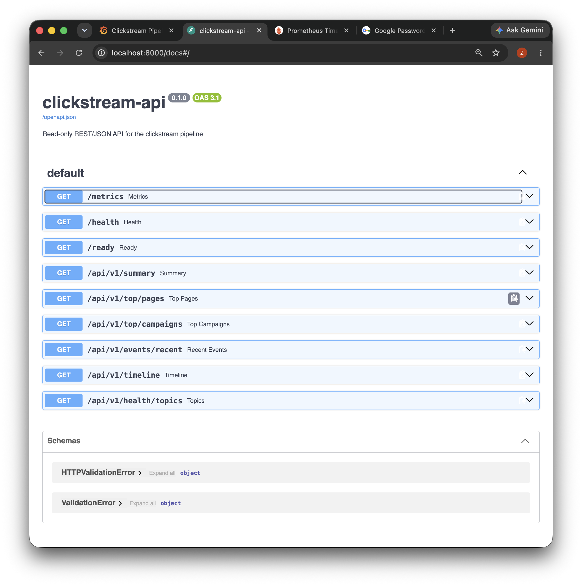
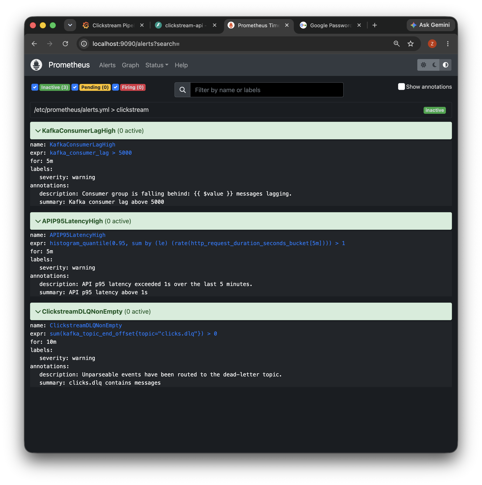
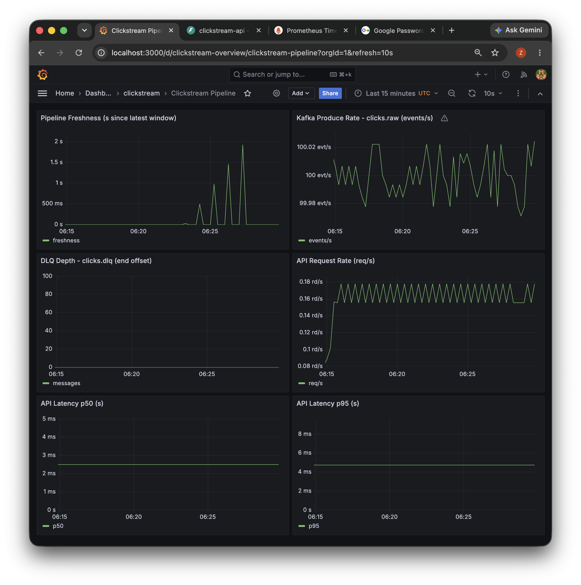

# Demo Checklist — Local Full-Stack Clickstream Pipeline

A practical checklist for showing the running pipeline (producer → Kafka → Spark →
PostgreSQL/ClickHouse → API → Grafana) in a live demo. Run everything locally with
Docker (colima on macOS) — no cloud resources are used.

## 1. Quick links

| Service | URL | Credentials |
|---|---|---|
| Grafana | http://localhost:3000 | `admin` / `admin` (compose default; recreated containers reset to it) |
| Prometheus | http://localhost:9090 | none |
| Alertmanager | http://localhost:9093 | none |
| API (Swagger UI) | http://localhost:8000/docs | none |
| Spark Master UI | http://localhost:8080 | none |
| Spark Worker UI | http://localhost:8081 | none |

## 2. Before you start

```bash
colima start            # macOS: start the Docker runtime if not running
make up                 # docker compose up -d --build (first run pulls/builds images)
```

Check every service is healthy:

```bash
docker compose ps
```

Look for `healthy` on kafka, postgres, clickhouse, redis, api, prometheus,
alertmanager, grafana, spark-master. `kafka-init` should have exited `0`.

## 3. 30-second health check

```bash
# API liveness + readiness (checks Postgres, ClickHouse, Kafka)
curl -s http://localhost:8000/health
curl -s http://localhost:8000/ready          # expect {"status":"ready", ...}

# Prometheus scrape targets
open http://localhost:9090/targets           # api + kafka-exporter should be UP
```

## 4. Verify live data (API)

```bash
curl -s http://localhost:8000/api/v1/summary            # totals keep growing
curl -s "http://localhost:8000/api/v1/top/pages?limit=5"
curl -s "http://localhost:8000/api/v1/events/recent?limit=5"   # raw events (ClickHouse)
curl -s "http://localhost:8000/api/v1/timeline?limit=5"         # 1-min windows (ClickHouse)
curl -s http://localhost:8000/api/v1/health/topics       # clicks.raw / clicks.dlq
```



*Swagger UI at http://localhost:8000/docs. During a demo, use **Try it out** on
`/api/v1/summary` or `/api/v1/events/recent` to show live data.*

## 5. Data-flow verification (bottom-up)

```bash
# Kafka topics + a few raw messages
docker exec clickstream-kafka /opt/kafka/bin/kafka-topics.sh \
  --bootstrap-server localhost:9092 --list

# PostgreSQL curated tables (Spark sink)
docker exec clickstream-postgres psql -U click -d clickstream \
  -c "select count(*) from curated.page_views_1m;"

# ClickHouse OLAP (Spark sink, FINAL dedups ReplacingMergeTree)
docker exec clickstream-clickhouse clickhouse-client \
  --query "select count() from olap.clicks FINAL;"
```

If these counts grow over a few seconds, the whole pipeline is alive.

## 6. Prometheus — queries that return data (verified)

> Note: Spark Structured Streaming uses `assign()` and manages offsets in
> checkpoints, so it does **not** register a broker consumer group — broker-based
> "consumer lag" is not meaningful here. We surface freshness instead.

| What | PromQL |
|---|---|
| Produce rate (events/s) | `sum(rate(kafka_topic_partition_current_offset{topic="clicks.raw"}[1m]))` |
| Pipeline freshness (s since latest curated window) | `pipeline_freshness_seconds` |
| DLQ depth | `sum(kafka_topic_end_offset{topic="clicks.dlq"})` |
| API request rate | `sum(rate(http_requests_total[1m]))` |
| API latency p50 | `histogram_quantile(0.50, sum by (le) (rate(http_request_duration_seconds_bucket[5m])))` |
| API latency p95 | `histogram_quantile(0.95, sum by (le) (rate(http_request_duration_seconds_bucket[5m])))` |

Give `pipeline_freshness_seconds` ~1 minute after starting the stack (background
collector refreshes every 15s + Prometheus scrapes every 15s).



*Alerts page at http://localhost:9090/alerts: `KafkaConsumerLagHigh`,
`APIP95LatencyHigh` and `ClickstreamDLQNonEmpty` are all **inactive** on a
healthy run (shown above).*

## 7. Grafana dashboard

1. Sign in at http://localhost:3000 (`admin` / `admin`).
2. Open **Dashboards → clickstream → Clickstream Pipeline**.
3. Set the time range to **Last 15 minutes** (top-right). Panels refresh every 10s.
4. Panels:
   - **Pipeline Freshness** — should be a few seconds to a couple of minutes.
   - **Kafka Produce Rate (clicks.raw)** — should hover near 100 events/s.
   - **DLQ Depth** — 0 unless bad events were injected.
   - **API Request Rate / Latency p50 / p95** — tick up when you hit the API.



*Dashboard at
http://localhost:3000/d/clickstream-overview/clickstream-pipeline
(click the dashboard title and set the time range to **Last 15 minutes**).*

## 8. Suggested 3–5 minute demo flow

1. `docker compose ps` — all healthy; producer logs show ~100 ev/s, 0 failed
   (`docker compose logs --tail=5 producer`).
2. `curl http://localhost:8000/ready` — all backend checks green.
3. Show `http://localhost:8000/docs` and run one or two read-only queries
   (`/api/v1/summary`, `/api/v1/events/recent`).
4. Open Grafana and point at the **Last 15 minutes** dashboard while hitting the
   API a few times — watch request rate and latency tick.
5. (Optional) Show Kafka/Spark/ClickHouse/PostgreSQL counts from §5.

## 9. Troubleshooting notes

- **Grafana says wrong password**: `docker compose up -d --force-recreate grafana`
  resets it to `admin`/`admin` (no data volume is persisted).
- **Empty Prometheus results**: double-check metric names (see §6); several
  kafka-exporter metrics such as `kafka_consumergroup_lag` do not exist in this
  exporter/stack.
- **Changed code?** `make up` again — it rebuilds changed images
  (`docker compose up -d --build`).
- **Stop the producer** (default is always-on): `docker compose stop producer`.
- **Reset all data**: `docker compose down -v && make up` (fresh Postgres/ClickHouse).
- **Grafana dashboard not loaded**: wait up to 30s (provisioning provider refresh)
  or `docker compose restart grafana`.

## 10. Reference values from a verified run (2026-09-01)

Observed on a healthy local run (steady mode, producer running ~53 minutes; the
screenshots above are from the same session). Re-measure on your own machine —
these are reference values, not guarantees.

| Metric | Observed value |
|---|---|
| Produce rate | ~100.0 events/s, 0 failed |
| Total produced (run) | ~319k events in ~53 min |
| End-to-end freshness | 0 s (latest 1-min window is the current minute) |
| DLQ depth | 0 |
| API latency p50/p95 - `/api/v1/summary` | 25.6 / 32.9 ms (client) · 21 / 46 ms (Prometheus) |
| API latency p50/p95 - `/api/v1/events/recent` | 46.9 / 73.1 ms (client) · 42 / 90 ms (Prometheus) |
| API latency p50/p95 - `/api/v1/top/pages` | 10.4 / 14.6 ms (client) · 8.5 / 22 ms (Prometheus) |

Client numbers: 50 sequential requests per endpoint from the host. Prometheus
numbers:
`histogram_quantile(0.50/0.95, sum by (le, path) (rate(http_request_duration_seconds_bucket[2m])))`.
